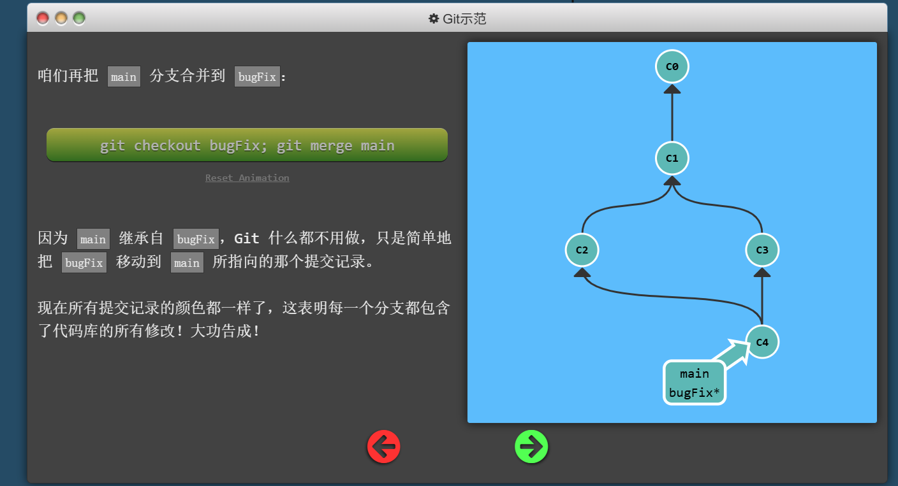
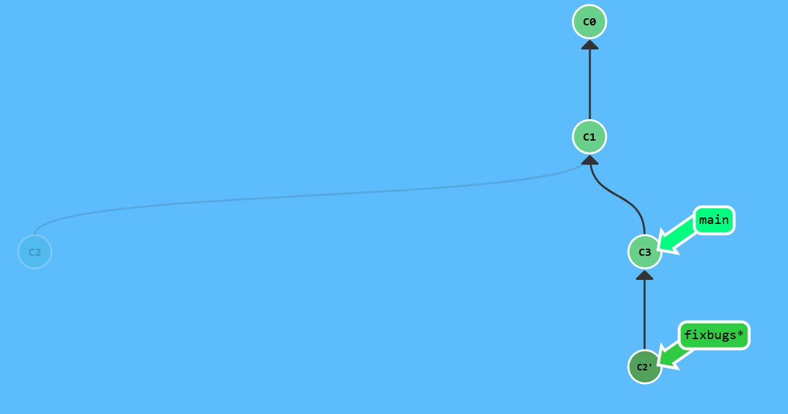
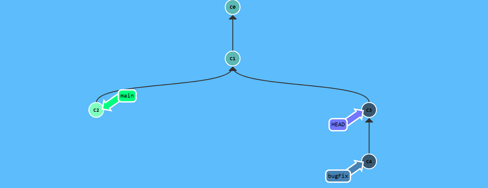
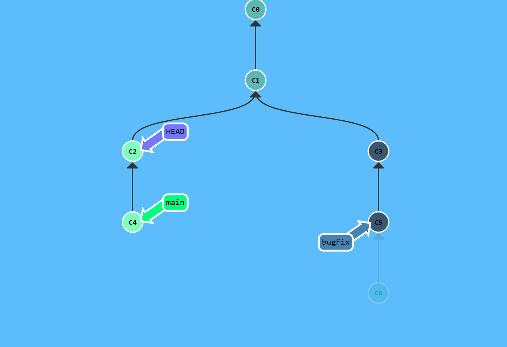
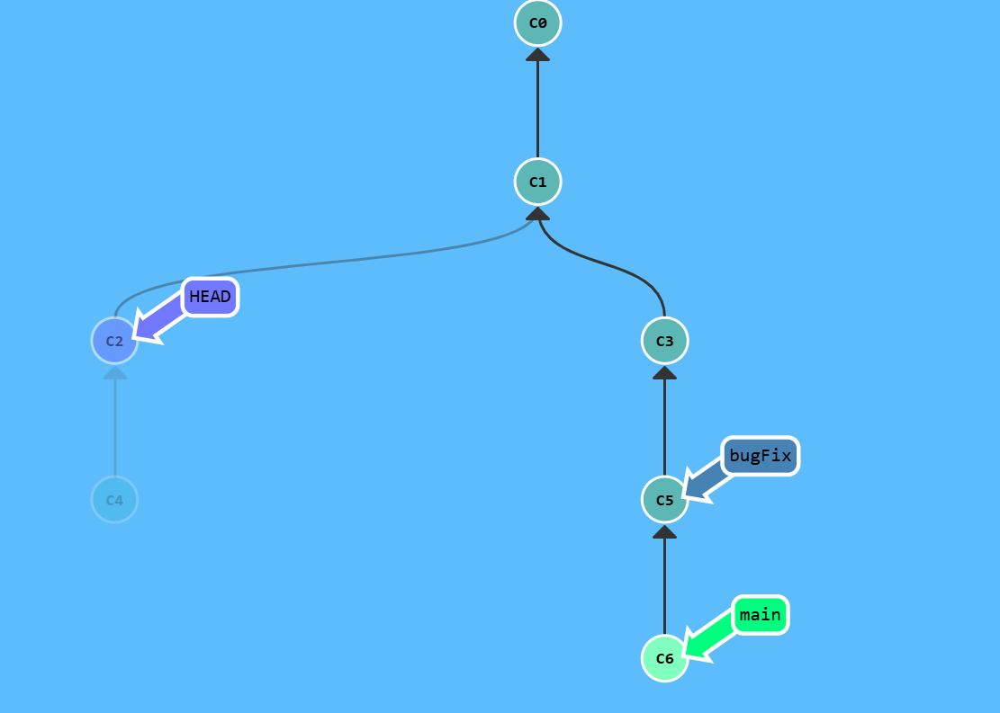
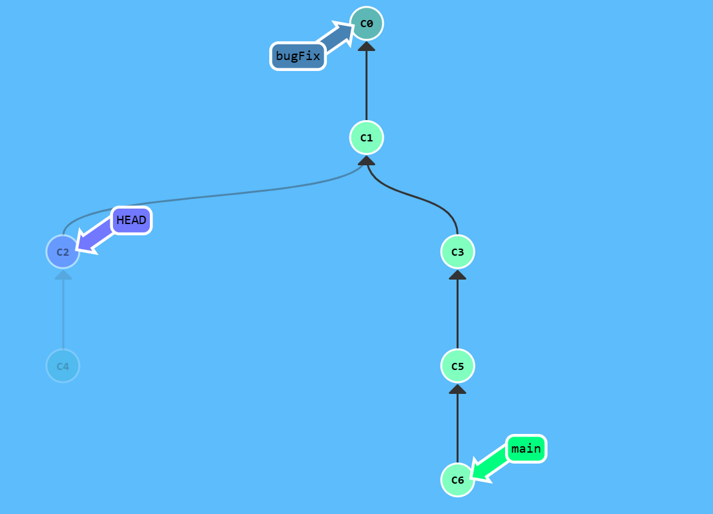
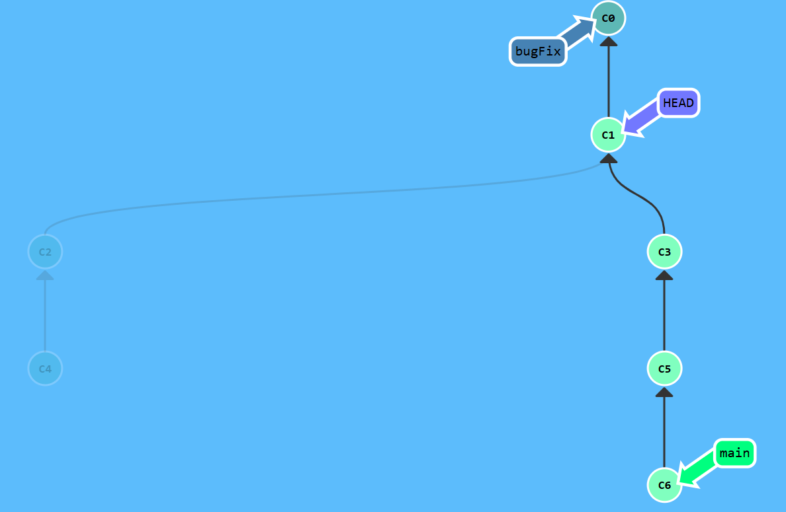

## 关于Git Merge

在这张图中，当运行`git checkout bugfix; git merge main`时，会执行**快速合并**，即把bugfix的指针移到main，快速提交当**要合并的分支是当前分支的子分支才会发生**，如下图

## 关于Git Rebase

`git rebase`的作用是将当前分支**相对于共同祖先**的提交，重新replay[^1]到目标分支的最新提交之后，并更新当前分支指针的位置。  

[^1]: 即按**变更顺序**应用到目标分支的最新提交之后
## 关于Git Checkout
`git checkout -b demo`新建一个demo分支并切换到该分支  
`git checkout 哈希值`分离HEAD指针，即让其指向某个**具体的提交记录**而不是分支名  
注意：由于git的哈希值基于SHA-1，有40位，所以肯定不可能输入所有，对于此你只需要输入哈希值的前几位就可。当然，也不可能每一次都通过哈希值改变HEAD指针的位置，所以你可以使用相对位置。

我们使用`git checkout bugFix^`来达成这一点。`git checkout demo^^`两个'^'就是移动两级咯~  
使用`git checkout bugFix~3`来移动多次（如果有的话）。下面是一个例题：  
初始是这样的

`git branch -f main C6`

`git branch -f bugFix main~4`

`git checkout HEAD^`

这就通关了。注意`git branch -f demo HEAD~2`或者`git branch -f demo main^`两种都可，无论是基于HEAD还是某一分支。`-f`是强制操作。